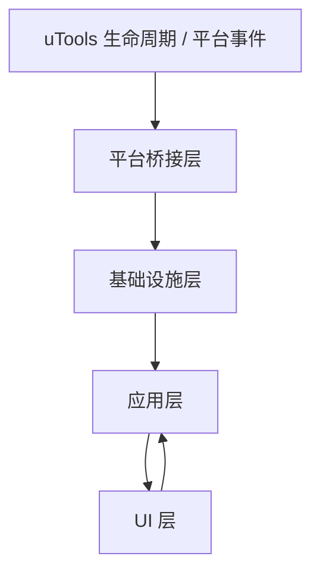

# 剪贴板管理插件技术设计

## 1. 文档目标

本文档基于 PRD，给出面向当前仓库的可实现技术方案，用于指导 MVP 开发。

当前仓库是一个基于 React + Vite 的 uTools 初始项目，现阶段仅有示例入口与示例页面，尚未建立正式业务结构。因此本设计会同时覆盖：

- 技术架构
- 目录规划
- 数据模型
- 存储方案
- 剪贴板监听方案
- 搜索与性能方案
- UI 组件拆分
- 开发阶段拆分

对应 PRD 见 [clipboard-plugin-prd.md](D:\WorkSpace\3-Codes\AIGC\copper\docs\clipboard-plugin-prd.md)。

## 2. 设计目标

### 2.1 业务目标

- 后台持续记录系统剪贴板变化
- 在单页内提供历史区与收藏区双栏工作流
- 支持文本、图片、文件三类 MVP 内容闭环
- 支持 5000 到 10000 条记录规模下的快速搜索
- 保障键盘优先操作链路

### 2.2 技术目标

- 前端渲染与系统剪贴板监听解耦
- 历史、收藏、设置、索引四类数据结构清晰分层
- 大文件和图片不直接塞进主数据库文档
- 搜索不依赖每次全量扫描
- Windows 与 macOS 主流程尽可能统一

## 3. 总体架构

建议采用四层架构：

1. `UI 层`
   负责页面渲染、键盘交互、焦点管理、展示状态。

2. `应用层`
   负责业务编排，例如新剪贴板内容入库、历史转收藏、删除语义、搜索聚合、设置生效。

3. `基础设施层`
   负责数据库读写、图片文件落地、索引维护、系统剪贴板读写、uTools API 适配。

4. `平台桥接层`
   负责 preload、Node/Electron 能力、uTools 插件生命周期，以及后台监听所需的平台特化实现。

整体关系如下：



## 4. 技术选型

### 4.1 现有依赖

- React 19
- Vite 6
- `utools-api-types`

### 4.2 建议新增依赖

- 状态管理：
  - 优先 `zustand`，轻量，适合 UI 状态与业务状态分离
- 搜索：
  - MVP 可自研轻量本地索引
  - 若后续需要复杂中文分词，可再引入专用库
- 拼音支持：
  - 选择轻量拼音转换库，仅用于构建索引字段
- 代码渲染：
  - 非 MVP，可后续再接入
- 虚拟列表：
  - 若数据量和图片渲染压力偏大，可引入 `@tanstack/react-virtual`

备注：

- 搜索不建议一开始引入重量级全文检索库
- 当前规模在 10000 条以内，合理设计索引结构即可达成目标

## 5. 运行时边界

## 5.1 前端渲染进程职责

- 渲染主页面与设置页
- 管理搜索输入、选中项、焦点、Tab、主题等 UI 状态
- 发起复制、粘贴、删除、收藏、编辑等用户动作
- 显示历史与收藏搜索结果

### 5.2 preload / Node 侧职责

- 注册 uTools 生命周期事件
- 管理后台剪贴板监听
- 执行图片文件持久化
- 读取系统剪贴板结构化内容
- 执行文本 / 图片 / 文件粘贴
- 读写本地数据库

### 5.3 边界原则

- UI 不直接依赖底层剪贴板结构
- 所有系统能力通过统一 service 接口暴露
- 页面只面向标准化后的业务对象渲染

## 6. 建议目录结构

建议将现有示例目录替换为下述业务结构：

```text
src/
  app/
    App.jsx
    router.js
    plugin-lifecycle.js
  pages/
    clipboard/
      index.jsx
      index.css
    settings/
      index.jsx
      index.css
  components/
    search-bar/
    split-layout/
    pane-header/
    history-list/
    favorite-list/
    clipboard-item/
    image-item/
    file-item/
    text-item/
    tab-bar/
    empty-state/
    settings-form/
  stores/
    ui-store.js
    history-store.js
    favorite-store.js
    settings-store.js
    search-store.js
  services/
    clipboard/
      clipboard-listener.js
      clipboard-reader.js
      clipboard-writer.js
      clipboard-normalizer.js
    history/
      history-service.js
      favorite-service.js
      search-service.js
    storage/
      db-repository.js
      file-repository.js
      settings-repository.js
      search-index-repository.js
    platform/
      utools-service.js
      preload-bridge.js
  domain/
    clipboard-item.js
    history-item.js
    favorite-item.js
    favorite-tab.js
    search-result.js
    settings.js
  utils/
    time.js
    pinyin.js
    hash.js
    text.js
    file.js
  styles/
    tokens.css
    theme-light.css
    theme-dark.css
    base.css
preload/
  index.js
  clipboard-monitor.js
  clipboard-platform/
    windows.js
    macos.js
docs/
```

说明：

- `src` 主要承载渲染层和应用层
- `preload` 主要承载 Node / 平台桥接层
- 若最终 uTools 模板要求 preload 与配置文件放在其他位置，可按实际脚手架适配，但职责不变

## 7. 路由与页面结构

当前项目已有按 `action.code` 切换页面的基础逻辑。正式实现建议保留这种模式，但只保留两个业务入口：

- `clipboard`：主页面
- `settings`：设置页

建议：

- 插件默认入口为 `clipboard`
- 设置页作为次级页面，可由主页面快捷进入
- 不再保留示例 `hello / read / write`

## 8. 核心领域模型

## 8.1 统一剪贴板对象

所有从系统读取到的内容，先归一化为统一结构：

```ts
type ClipboardPayload = {
  type: 'text' | 'html' | 'image' | 'file' | 'files'
  text?: string
  html?: string
  imageBuffer?: Uint8Array
  imageMime?: string
  filePaths?: string[]
  sourceMeta?: {
    fileNames?: string[]
  }
}
```

这个结构只用于监听和入库前的标准化处理，不直接用于页面展示。

## 8.2 历史记录模型

```ts
type HistoryItem = {
  id: string
  type: 'text' | 'html' | 'image' | 'file' | 'files'
  dedupeKey: string | null
  displayText: string
  contentText: string | null
  contentHtml: string | null
  filePaths: string[] | null
  imageAssetId: string | null
  metadata: {
    charCount?: number
    lineCount?: number
    fileNames?: string[]
    fileCount?: number
    imageWidth?: number
    imageHeight?: number
  }
  copyCount: number
  createdAt: number
  lastCopiedAt: number
  updatedAt: number
  isDeleted: boolean
}
```

说明：

- `displayText` 用于列表展示和快速搜索结果渲染
- `contentHtml` 先保留结构，MVP 不一定完整用于回放
- `dedupeKey` 只对文本类启用

## 8.3 收藏模型

```ts
type FavoriteItem = {
  id: string
  sourceHistoryId: string | null
  type: 'text' | 'html' | 'image' | 'file' | 'files'
  title: string | null
  displayText: string
  contentText: string | null
  contentHtml: string | null
  filePaths: string[] | null
  imageAssetId: string | null
  metadata: object
  createdAt: number
  updatedAt: number
  isDeleted: boolean
}
```

说明：

- 收藏是独立实体，不依赖历史项继续存在
- 编辑作用于收藏实体本身，因此被多个 Tab 引用时需同步生效

## 8.4 Tab 模型

```ts
type FavoriteTab = {
  id: string
  name: string
  sortOrder: number
  createdAt: number
  updatedAt: number
}
```

## 8.5 Tab 关联模型

```ts
type FavoriteTabLink = {
  id: string
  tabId: string
  favoriteId: string
  sortOrder: number
  createdAt: number
}
```

## 8.6 图片资源模型

```ts
type ImageAsset = {
  id: string
  storagePath: string
  mime: string
  byteSize: number
  width: number | null
  height: number | null
  createdAt: number
}
```

## 8.7 设置模型

```ts
type UserSettings = {
  themeMode: 'light' | 'dark' | 'system'
  maxHistoryCount: number
  minRetentionDays: number
  imagePreviewMaxHeight: number
  textCollapsedLines: number
  listenInBackground: boolean
  defaultFocusTarget: 'search'
}
```

## 9. 存储设计

## 9.1 存储原则

- 主数据与大对象分离
- 图片落地文件系统，数据库只存索引
- 历史、收藏、Tab、设置、索引分开存储
- 删除优先做软删，清理任务再做物理清除

## 9.2 数据库存储建议

PRD 中接受“只要插件代码不主动联网即可”，因此 MVP 可先使用 uTools 本地数据库承载文档型数据。

建议按集合逻辑划分文档前缀：

- `history:`
- `favorite:`
- `favorite-tab:`
- `favorite-link:`
- `image-asset:`
- `settings:singleton`
- `search-index:`

考虑到 uTools 数据库的实际能力和后续维护成本，建议封装统一仓储层，不要在业务代码里直接散落 `utools.db.put/get/allDocs`。

## 9.3 图片存储

图片原图落地到插件私有目录，例如：

```text
<plugin-data-dir>/
  assets/
    images/
      2026/
        03/
          <image-id>.png
```

设计理由：

- 避免数据库文档膨胀
- 避免 10000 条记录下图片导致主列表读写变慢
- 后续便于做懒加载和缩略图策略

## 9.4 文件记录

文件、文件夹、多文件复制仅保存：

- 原路径
- 文件名
- 文件数量
- 失效状态

不做快照。

这符合当前产品决定，也能显著降低磁盘占用与跨平台复杂度。

## 9.5 清理策略

清理逻辑需要同时满足：

- 至少保留 30 天
- 总量控制在 5000 到 10000

建议策略：

1. 每次新增历史项后检查总量
2. 若总量未超上限，不清理
3. 若超上限，优先清理超过 30 天且最旧的历史项
4. 若仍超过上限，则继续按最旧历史项清理
5. 清理历史项时同步检查孤儿图片资源

说明：

- 收藏实体永不受历史清理影响
- 被收藏引用的图片资源不能因历史清理直接删除

## 10. 去重策略

## 10.1 文本去重

仅文本类进入去重逻辑，建议 dedupeKey 生成方式：

- 去除两端空白
- 标准化换行符
- 保留正文内容
- 生成稳定 hash

遇到相同 `dedupeKey` 时：

- `copyCount + 1`
- `lastCopiedAt = now`
- 可同步更新部分展示元信息

## 10.2 图片与文件

图片和文件永远按新记录插入，不参与文本 dedupeKey 逻辑。

原因：

- 用户已明确要求图片和文件独立记条
- 相同路径文件也可能发生内容变化
- 图片复制场景强调事件记录，不适合简单合并

## 11. 剪贴板监听设计

## 11.1 目标

在插件未打开时也能持续监听系统剪贴板变化。

## 11.2 设计建议

监听链路分为三步：

1. 平台层检测“系统剪贴板发生变化”
2. 读取剪贴板当前内容
3. 标准化后入库

## 11.3 平台抽象接口

```ts
type ClipboardMonitor = {
  start(): void
  stop(): void
  onChange(callback: () => void): () => void
}
```

```ts
type ClipboardReader = {
  readCurrent(): Promise<ClipboardPayload | null>
}
```

## 11.4 平台实现建议

### Windows

优先方案：

- 在 preload / Node 侧结合 Electron 或 Node 可访问能力实现剪贴板轮询或事件监听

备选方案：

- 使用固定频率轮询系统剪贴板版本号或内容签名

### macOS

优先方案：

- 使用系统剪贴板变更计数或 Electron 能力做轮询监听

备选方案：

- 固定间隔轮询当前剪贴板签名

## 11.5 MVP 监听策略建议

由于 uTools 官方文档对“后台全局剪贴板监听”能力边界未明确给出现成 API，MVP 建议采用“轮询 + 签名去重”的保守实现。

建议策略：

- 轮询间隔 300ms 到 800ms，可配置
- 每次读取当前剪贴板并生成轻量签名
- 若签名无变化，则跳过
- 若有变化，进一步读取完整内容并归档

优点：

- 实现简单
- 跨平台一致性更高
- 可控且容易调试

代价：

- 会带来常驻开销
- 富文本/图片读取需谨慎控制成本

## 11.6 剪贴板签名

建议为不同内容生成轻量签名：

- 文本：内容 hash
- HTML：HTML hash
- 图片：字节 hash 或尺寸加前缀 hash
- 文件：路径列表拼接 hash

签名只用于“是否发生变化”判断，不直接用于最终业务 dedupe。

## 12. 复制与粘贴设计

## 12.1 统一写回接口

```ts
type ClipboardWriter = {
  copy(item: ClipboardRenderableItem): Promise<void>
  pasteToPreviousApp(item: ClipboardRenderableItem): Promise<void>
}
```

## 12.2 行为映射

- `Enter`
  - 仅执行复制到系统剪贴板
- `Space`
  - 调用 uTools 粘贴能力回填到插件呼出前窗口
  - 完成后关闭插件

## 12.3 类型映射

- 文本：写入文本 / 粘贴文本
- 图片：写入图片 / 粘贴图片
- 文件：写入文件路径 / 粘贴文件
- 多文件：批量写入文件路径 / 粘贴文件数组

## 12.4 HTML / 富文本

MVP 不承诺完整“富文本原样粘贴”。

建议策略：

- 入库时尽量保留 `contentHtml`
- 列表展示以文本抽取为主
- 粘贴时第一阶段优先保证文本内容可回填
- 富文本增强在第二阶段推进

这样可以满足“内容尽量原样保留”的方向，又不会把 MVP 卡死在格式保真上。

## 13. 搜索设计

## 13.1 搜索目标

- 10000 条规模下快速返回
- 历史与收藏异步搜索
- 支持模糊搜索
- 支持拼音搜索
- 支持高亮命中

## 13.2 搜索字段

每个项目维护独立 `searchText`：

- 文本内容标准化后的正文
- 标题
- 文件名
- 抽取后的纯文本内容
- 中文文本对应拼音全拼和首字母

例如：

```ts
searchText = [
  title,
  displayText,
  normalizedText,
  fileNames,
  pinyinFull,
  pinyinInitials
].join('\n')
```

## 13.3 搜索索引策略

MVP 建议使用“内存索引 + 本地持久化源数据”的折中方案：

- 启动时加载历史与收藏必要字段
- 构建内存搜索索引
- 数据发生增删改时增量更新索引

实现建议：

- 不在搜索时访问图片文件
- 不在搜索时加载 hover 详情
- 不在搜索时触发复杂异步 IO

## 13.4 匹配流程

建议匹配顺序：

1. 完全包含匹配
2. 前缀匹配
3. 模糊字符序列匹配
4. 拼音全拼匹配
5. 拼音首字母匹配

同层结果排序建议：

- 匹配质量分
- `lastCopiedAt` 或 `updatedAt`

## 13.5 历史与收藏异步搜索

搜索服务对历史和收藏分别执行：

```ts
searchHistory(query): Promise<SearchResult[]>
searchFavorites(query): Promise<SearchResult[]>
```

UI 侧分别消费结果并独立展示加载状态。

## 13.6 高亮

高亮在渲染层完成，不写入数据库。

建议：

- 基于命中片段位置做局部高亮
- 拼音命中时若无法精确映射全文字符位置，可退化为整项高亮提示

## 14. UI 设计与状态管理

## 14.1 页面结构

主页面结构建议：

```text
ClipboardPage
  SearchBar
  SplitLayout
    HistoryPane
      PaneHeader
      HistoryList
    FavoritePane
      PaneHeader
      TabBar
      FavoriteList
```

## 14.2 状态分层

### UI 状态

- 当前激活分栏
- 当前选中索引
- 搜索关键字
- 当前收藏 Tab
- hover item id
- 设置页是否打开

### 业务状态

- 历史数据
- 收藏数据
- Tab 数据
- 搜索结果
- 图片资源状态
- 后台监听状态

### 持久状态

- 设置项
- 历史记录
- 收藏实体
- Tab 和关联关系

## 14.3 焦点模型

用户要求默认在历史区，因此建议焦点逻辑如下：

1. 页面打开时，搜索框聚焦
2. 输入搜索关键字后，按 `↓` 进入历史区第一项
3. 按 `→` 或 `Tab` 进入收藏区
4. 收藏区内继续使用 `↑↓`
5. `Ctrl/Cmd + 1~9` 直接切换收藏 Tab

## 14.4 删除语义

由于当前需求对收藏删除语义有一定冲突风险，建议 MVP 实现时明确区分内部处理：

- 历史区删除：删除历史记录
- 收藏区删除：
  - 若该收藏仅被一个 Tab 引用，删除收藏实体
  - 若被多个 Tab 引用，按当前确认需求删除收藏实体及所有引用

实现上建议仍保留一个底层方法：

- `removeFavoriteEntity(favoriteId)`
- `unlinkFavoriteFromTab(tabId, favoriteId)`

即便 UI MVP 只暴露一个删除动作，底层也保留更细能力，便于后续修正交互而不重构数据层。

## 15. 性能设计

## 15.1 渲染性能

- 列表项尽量纯展示
- hover 详情异步加载
- 图片使用懒加载
- 达到一定规模后接入虚拟列表

## 15.2 搜索性能

- 输入变化采用轻量防抖，建议 30ms 到 80ms
- 搜索只走内存索引
- 查询结果限制首屏返回量，例如每栏先返回前 100 条

## 15.3 存储性能

- 图片不进主数据库
- 文本 dedupe 更新尽量使用定向读写
- 批量清理时分段执行，避免阻塞

## 15.4 启动性能

启动阶段分为：

1. 快速加载设置
2. 快速加载历史与收藏索引必要字段
3. 页面首屏渲染
4. 异步补全 hover 元信息

## 16. 主题与设置设计

设置页应至少提供：

- 主题模式
- 历史上限
- 图片最大高度
- 长文本折叠行数
- 后台监听开关

技术上建议：

- 设置变更立即写入本地
- 主题模式通过根节点 data-attribute 切换
- 不依赖组件级样式条件分支堆叠

## 17. 与当前仓库的改造关系

当前 [App.jsx](D:\WorkSpace\3-Codes\AIGC\copper\src\App.jsx) 仍是示例型入口，根据正式方案需要：

- 删除示例路由 `hello / read / write`
- 改为 `clipboard / settings`
- 将 `window.utools.onPluginEnter` 生命周期封装到 `plugin-lifecycle.js`
- 将页面路由与业务状态解耦

当前 [main.css](D:\WorkSpace\3-Codes\AIGC\copper\src\main.css) 只适合演示，不适合作为正式 UI 基础。正式实现应拆为：

- 基础 reset
- 主题 token
- 页面级样式
- 组件级样式

## 18. 开发分阶段计划

## 18.1 阶段一：骨架改造

- 替换示例入口
- 建立 `clipboard` 与 `settings` 页面
- 建立基础 store 和 service 目录
- 建立主题系统

交付标准：

- 页面可进入主界面和设置页
- 双栏布局与搜索框完成
- 键盘焦点主流程可跑通

## 18.2 阶段二：本地数据层

- 建立仓储层
- 建立历史、收藏、Tab 数据结构
- 建立图片资源目录管理
- 建立设置持久化

交付标准：

- 可手工插入、读取、删除历史与收藏数据

## 18.3 阶段三：监听与闭环

- 建立后台剪贴板监听
- 打通文本、图片、文件三类归档
- 打通复制与粘贴
- 打通历史转收藏

交付标准：

- 文本、图片、文件可稳定记录与回填

## 18.4 阶段四：搜索与性能

- 构建内存索引
- 加入拼音搜索
- 优化渲染与 hover 懒加载
- 接入虚拟列表或保留可扩展接口

交付标准：

- 5000 到 10000 条规模下仍可顺畅搜索和滚动

## 18.5 阶段五：富文本增强

- 存储 HTML 结构
- 优化浏览器复制内容展示
- 评估 Excel / WPS / Office 内容回放能力

交付标准：

- 富文本内容具备更强保真能力

## 19. 风险与验证计划

## 19.1 高风险项

- uTools 环境下后台监听系统剪贴板的可行性与稳定性
- macOS 与 Windows 在文件、图片、富文本处理上的行为差异
- HTML / 富文本 / Excel 的统一抽象难度

## 19.2 建议先做的技术验证

在正式大规模开发前，建议先完成 3 个 spike：

1. 验证后台监听是否能在插件未打开 UI 时稳定工作
2. 验证文本、图片、文件三类复制与粘贴闭环是否都能覆盖 Windows 和 macOS
3. 验证图片落地文件 + 数据库索引 + 删除清理链路是否可靠

## 20. 结论

本项目的关键难点不在 React 页面，而在“系统剪贴板监听 + 多类型内容归一化 + 本地高性能索引”三件事。

因此开发策略应当是：

- 先搭出页面和数据骨架
- 再打通文本、图片、文件闭环
- 再补搜索和性能
- 最后推进富文本保真

这条路径最符合当前需求优先级，也最能降低早期返工风险。

